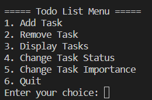

# Todo_list_application-cornelie-CDFO4
A console based application to help keep track of tasks. You should be able to add, delete, complete tasks.

## Prerequisites

- Python
- Git

### How to run the application 
 After cloning this repository on you local machine you can run the terminal using spyder or any other IDE and the app will start automatically in the terminal.

 To clone you can use : 

 ```
 git clone https://github.com/Laaliieee/Todo_list_application-cornelie-CDFO4.git
 ```
### How to use the application

You are directly in the main menu. Here you can add and remove tasks. You can also change tasks importance and progress state. 




 ### Your contribution
 You have to add to this more features explained at the end of the todo_application file like : 
 - Classify the importance of the task (Cand be done after - important - highly important)
 - Give the status of the task (started - in progress - finished)
 - Give a quick feedback of the task (a short text)
